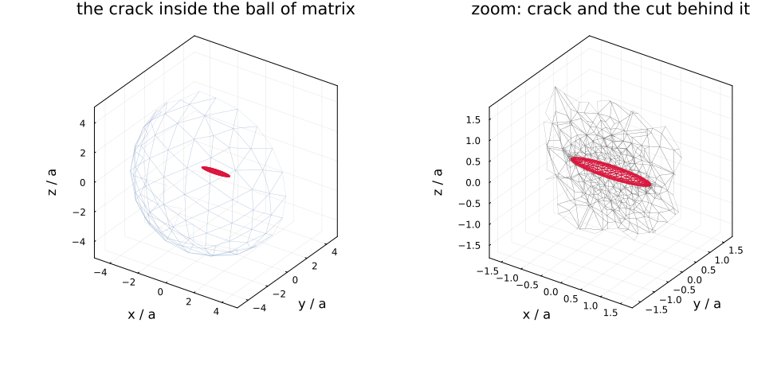
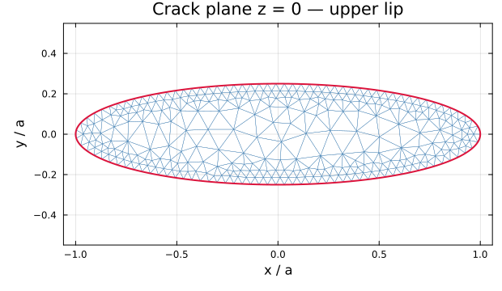
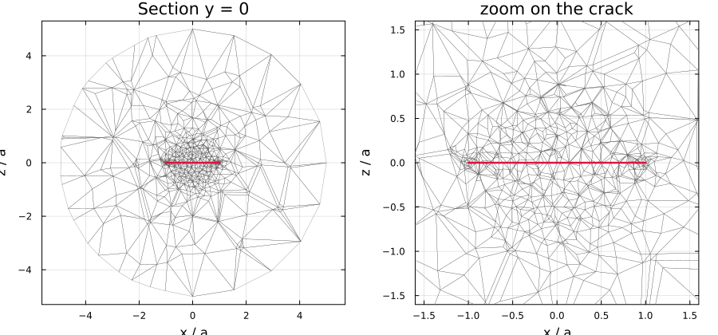
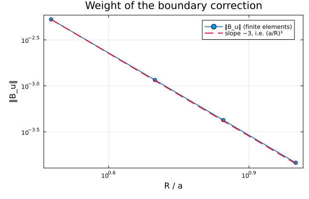
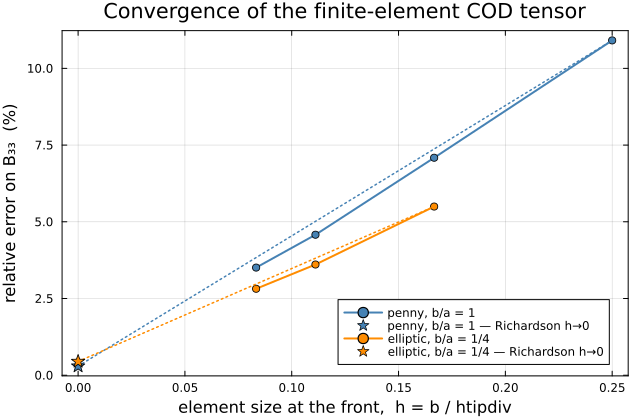

# [Finite-element inclusions](@id man-fe-inclusions)

When a morphology has no closed-form Eshelby solution, its response can be
computed numerically and fed to the schemes through the
[custom-inclusion contract](@ref man-custom-inclusions). `MeanFieldHom` ships
one such inclusion: [`FEEllipticCrack`](@ref MeanFieldHom.FEEllipticCrack),
whose crack-opening-displacement tensor comes out of a `Ferrite.jl` solve.

```julia
using MeanFieldHom
import Ferrite, FerriteGmsh, Gmsh      # activates MeanFieldHomFerriteExt
```

Without those three packages the type still exists but every solve raises an
informative error.

!!! note "This page is static"
    Nothing here is computed at documentation-build time. The figures and the
    numbers are produced once by `scripts/fe/make_doc_figures.jl` and
    committed; the live demonstrations are `scripts/81_fe_crack_eshelby.jl` and
    `scripts/82_fe_crack_schemes.jl`.

## The finite-size bias

We want the response of an **infinite** medium, but we can only mesh a
**finite** ball ``\Omega`` of radius ``R``. The obvious boundary condition is
the remote field itself,

```math
\mathbf u\big|_{\partial\Omega} = \mathbf E\cdot\mathbf x ,
\qquad \mathbf E = \mathbb S_0 : \boldsymbol\Sigma ,
```

but it *clamps* the perturbation radiated by the crack: the boundary is not
allowed to move the way the infinite medium would let it. The apparent opening
therefore carries a bias of order ``O\bigl((a/R)^3\bigr)``, which is why an
uncorrected computation needs `R/a` between 10 and 40 before it can be trusted.

## The crack radiates as an elastic dipole

A displacement discontinuity ``[\![\mathbf u]\!]`` across a surface ``S`` of
normal ``\hat{\mathbf n}`` is mechanically equivalent to a distribution of
**force dipoles** of density ``\mathbb C_0 : (\hat{\mathbf n}
\stackrel{s}{\otimes} [\![\mathbf u]\!])``. Seen from far away the whole crack
is therefore a single point dipole of intensity

```math
\boldsymbol\Pi = \int_S \mathbb C_0 : \bigl(\hat{\mathbf n}\stackrel{s}{\otimes}[\![\mathbf u]\!]\bigr)\,\mathrm dS
   = b\,S_f\; \mathbb C_0 : \bigl(\hat{\mathbf n}\stackrel{s}{\otimes}\mathbf U\bigr),
\qquad \mathbf U = \frac{\langle[\![\mathbf u]\!]\rangle}{b},
\quad S_f = \pi a b ,
```

with ``b`` the semi-minor axis — the normalization `cod_tensor` uses. The field
it generates is that dipole contracted with the gradient of the Green function,
so the *correct* far field is

```math
\mathbf u(\mathbf x)\;\underset{\|\mathbf x\|\to\infty}{\approx}\;
  \mathbf E\cdot\mathbf x
  \;-\; b\,S_f\,\bigl(\nabla\mathbb G(\mathbf x):\mathbb C_0\cdot\hat{\mathbf n}\bigr)\cdot\mathbf U .
```

The idea of [Adessina et al. (2017)](https://doi.org/10.1016/j.ijengsci.2017.03.015)
is to put that second term **into the boundary data**.

## Closing the loop: a 3 + 3 self-consistent scheme

The dipole intensity ``\mathbf U`` is itself unknown — it *is* what we are
trying to compute. Linearity resolves the circularity. Writing
``\langle[\![\mathbf u]\!]\rangle/b = \mathbf B\cdot\mathbf t`` with
``\mathbf t = \boldsymbol\Sigma\cdot\hat{\mathbf n}``, solve two families of
three problems on the same mesh:

| Family | Boundary condition | Yields |
|---|---|---|
| **traction**, ``\boldsymbol\Sigma^{(i)}\cdot\hat{\mathbf n} = \mathbf e_i`` | ``\mathbf u\big\|_{\partial\Omega} = (\mathbb S_0:\boldsymbol\Sigma^{(i)})\cdot\mathbf x`` | columns of ``\mathbf B_s`` |
| **dipole**, unit intensity ``\mathbf e_m`` | ``\mathbf u\big\|_{\partial\Omega} = -b\,S_f\bigl(\nabla\mathbb G:\mathbb C_0\cdot\hat{\mathbf n}\bigr)\cdot\mathbf e_m`` | columns of ``\mathbf B_u`` |

``\mathbf B_s`` is the COD tensor of the *truncated* cell; ``\mathbf B_u`` is
its response to the crack's own far field. Superposing,

```math
\mathbf U = \mathbf B_s\cdot\mathbf t + \mathbf B_u\cdot\mathbf U
\qquad\Longrightarrow\qquad
\mathbf U = (\mathbf 1 - \mathbf B_u)^{-1}\,\mathbf B_s\cdot\mathbf t ,
```

so the infinite-medium COD tensor follows in **one step** — no iteration:

```math
\boxed{\;\mathbf B_\infty = (\mathbf 1 - \mathbf B_u)^{-1}\cdot\mathbf B_s\;}
```

### The Green-function gradient

For an isotropic matrix ``\nabla\mathbb G`` is the Kelvin solution in closed
form. With ``r = \|\mathbf x\|``, ``\hat{\mathbf n} = \mathbf x/r`` and
``A = 1/\bigl(16\pi\mu(1-\nu)\bigr)``,

```math
G_{ij}(\mathbf x) = \frac{A}{r}\bigl[(3-4\nu)\,\delta_{ij} + n_i n_j\bigr],
\qquad
\frac{\partial G_{ij}}{\partial x_k}
  = \frac{A}{r^{2}}\bigl[-(3-4\nu)\,\delta_{ij}n_k + \delta_{ik}n_j + \delta_{jk}n_i - 3\,n_i n_j n_k\bigr],
```

and the contraction with a symmetric ``\boldsymbol\Pi`` collapses to a single
matrix-vector product,

```math
u_i = \frac{\partial G_{ij}}{\partial x_k}\Pi_{jk}
    = \frac{1}{16\pi\mu(1-\nu)r^{2}}
      \Bigl[-2(1-2\nu)\,\boldsymbol\Pi\!\cdot\!\hat{\mathbf n}
            + \operatorname{tr}(\boldsymbol\Pi)\,\hat{\mathbf n}
            - 3\,(\hat{\mathbf n}\!\cdot\!\boldsymbol\Pi\!\cdot\!\hat{\mathbf n})\,\hat{\mathbf n}\Bigr]_i .
```

That is [`green_gradient_iso`](@ref MeanFieldHom.Core.green_gradient_iso) and
[`dipole_displacement_iso`](@ref MeanFieldHom.Core.dipole_displacement_iso),
and it is why the matrix must currently be isotropic. For arbitrary anisotropy
``\nabla\mathbb G`` would come from the Willis angular integral, or from the
Pan–Chou closed form in the transversely isotropic case — neither is
implemented here.

### What is solved

Pure linear elasticity, ``\int_\Omega \boldsymbol\sigma(\mathbf u):
\boldsymbol\varepsilon(\mathbf v)\,\mathrm d\Omega = 0``, no body force. The
crack is a **zero-thickness discontinuity** — duplicated nodes — whose lips are
traction-free *naturally*: no interface term, no multiplier, no contact
condition. Only the outer sphere carries a Dirichlet condition, and its value
is the whole method.

Per evaluation: **one** assembly and **one** Cholesky factorization of the
free-free block, reused for all six right-hand sides. The mean opening is then
measured as a surface integral of the jump over each lip, with no assumption on
the opening profile:

```math
\mathbf U = \frac{1}{S_f\,b}\left(\int_{\Gamma^+}\mathbf u\,\mathrm dS - \int_{\Gamma^-}\mathbf u\,\mathrm dS\right).
```

## The mesh

A ball of matrix around an elliptical slit, refined in a torus hugging the
crack front — where the displacement field has its square-root singularity —
and coarsening to ``R/3`` on the outer boundary.



Left: the elliptical crack (red) suspended in the ball of matrix, whose far
hemisphere is drawn in light blue — the crack is deliberately small, since
``R = 5a``. Right: a zoom, with the ``y = 0`` cut face behind the crack
exposing how the tetrahedra grade from ``h = b/12`` at the front out to the
coarse far field.



The upper lip seen from ``+z``, with the exact ellipse in red. Elements shrink
towards the front.



Two details are worth stating, because both cost real debugging time in the
`SifAniso` study this is ported from:

- the crack disc is **`embed`ed** in the ball, never `fragment`ed — `fragment`
  would cut the ball into two disjoint half-balls;
- gmsh's `Crack` plugin duplicates the nodes of the crack **front** as well as
  those of the lips, in spite of `OpenBoundaryPhysicalGroup` (still true in
  gmsh 4.15). Left alone the crack is effectively half an element larger than
  requested and the opening is overestimated by 10–20 %. The front is therefore
  welded back together after import, which is also why the tetrahedra stay
  geometrically straight: `setOrder(2)` runs *after* the plugin and curves the
  two lips' front edges differently, pulling the welded front apart again at
  the mid-side nodes.

Straight tetrahedra with a P2 displacement field, then — subparametric, and
capped at P2 because Ferrite provides no cubic Lagrange element on tetrahedra.

## Using it

```julia
crack = FEEllipticCrack(1.0, 0.25; htipdiv = 12.0)

C₀ = iso_stiffness(0.8333, 0.3846)                 # E = 1, ν = 0.3
B_fe = cod_tensor(crack, C₀)
B_an = cod_tensor(EllipticCrack(1.0, 0.25), C₀)    # closed form, for comparison

rve = RVE(:M)
add_matrix!(rve, Ellipsoid(1.0), Dict(:C => C₀))
add_phase!(rve, :cracks, crack, Dict(:C => C₀); density = 0.05,
           symmetrize = IsoSymmetrize())
homogenize(rve, MoriTanaka(), :C)
```

That is the point of the contract: only `cod_tensor` is implemented, and
because the type subtypes `AbstractCrack` with a standard
[`shape_trait`](@ref MeanFieldHom.Core.shape_trait), ℍ, ℕ, 𝐑, 𝐍_K, the bundled
pair and the four `delta_*` with their Budiansky ``4\pi/3`` prefactor all
follow. Orientation averaging is applied by the scheme afterwards.

### Discretization

[`FEMeshOptions`](@ref MeanFieldHom.FEMeshOptions) — passed as keywords to the
constructor:

| Keyword | Default | Meaning |
|---|---|---|
| `radius_ratio` | `5.0` | `R/a`. Five is enough *because* the boundary condition is corrected. |
| `htipdiv` | `12.0` | element size at the crack front, `b/htipdiv`. |
| `order` | `2` | displacement interpolation order (1 or 2). |

### Diagnostics

```julia
fe_mesh_report(crack)         # cells, dofs, welded front pairs, lip areas vs πab
fe_cod_breakdown(crack, C₀)   # B_s, B_u, B_inf — bypasses the cache
fe_assembly_count(crack)      # factorizations actually performed
fe_reset!(crack)              # drop the mesh and the memoized tensors
```

## Validation

### The correction is the ``(a/R)^3`` dipole

``\|\mathbf B_u\|`` measures the truncation bias being removed. If the boundary
term really is the elastic dipole, it must fall like the cube of the domain
radius — and it does, over a decade:



| R/a | ‖B_u‖ |
|---|---|
| 3 | 5.273e-03 |
| 5 | 1.159e-03 |
| 7 | 4.240e-04 |
| 10 | 1.458e-04 |

Fitted log-log slope: **−2.98** against a theoretical −3. This is the sharpest
available check that the dipole boundary condition has the right magnitude
*and* the right sign — a sign error would not merely change the exponent, it
would send ``\mathbf B_\infty`` the wrong way.

Note how *small* the correction is at `R = 5a` (≈ 0.1 % on `B`). That is the
whole point: it is what makes so small a domain legitimate, at the cost of
three extra solves that share the existing factorization.

### Convergence to the closed form

The crack front carries a square-root displacement field, so a fixed-order
element converges slowly — in practice **first order in the element size**
``h \propto 1/\texttt{htipdiv}``. That regularity is what makes Richardson
extrapolation to ``h\to 0`` legitimate, and it turns a few-percent raw error
into a sub-percent verdict.



Isotropic matrix, ``E = 1``, ``\nu = 0.3``, `radius_ratio = 5`.

**Penny-shaped crack** (`b/a = 1`), closed form
`diag(B) = [1.81749, 1.81749, 1.54486]`:

| h at the front | dofs | diag(B) | relative error (%) |
|---|---|---|---|
| b/4 | 14 865 | [1.55789, 1.56444, 1.37630] | [−14.28, −13.92, −10.91] |
| b/6 | 21 954 | [1.65089, 1.65308, 1.43537] | [−9.17, −9.05, −7.09] |
| b/9 | 43 515 | [1.70740, 1.70724, 1.47413] | [−6.06, −6.07, −4.58] |
| b/12 | 86 784 | [1.73522, 1.73483, 1.49067] | [−4.53, −4.55, −3.51] |
| **h → 0** (Richardson) | — | **[1.81867, 1.81760, 1.54029]** | **[+0.06, +0.01, −0.30]** |

**Elliptical crack** (`b/a = 1/4`), closed form
`diag(B) = [3.09055, 2.33845, 2.26304]`:

| h at the front | dofs | diag(B) | relative error (%) |
|---|---|---|---|
| b/6 | 61 941 | [2.91496, 2.14285, 2.13865] | [−5.68, −8.36, −5.50] |
| b/9 | 117 516 | [2.97504, 2.21003, 2.18140] | [−3.74, −5.49, −3.61] |
| b/12 | 220 176 | [2.99958, 2.23898, 2.19927] | [−2.94, −4.25, −2.82] |
| **h → 0** (Richardson) | — | **[3.07321, 2.32582, 2.25291]** | **[−0.56, −0.54, −0.45]** |

The raw finite-element opening sits a few percent **below** the closed form,
and for two compounding reasons that both push the same way: a truncated cell
is stiffer than an infinite medium, and a fixed-order element under-resolves
the front. The extrapolated values land within a percent — the residual is
discretization, not a modelling error.

For reference, the FEniCSx implementation of the same scheme in the `SifAniso`
study reports ±5 % on ``\mathbf B_\infty`` at `htipdiv = 12` with P3 elements.

## Cost and memoization

One evaluation is one assembly, one factorization and six solves. Results are
**memoized on the reference medium expressed in the crack's own frame**, which
has a useful consequence: a whole family of orientations of the same crack in
the same isotropic matrix shares a single finite-element resolution.

One-shot schemes (`Dilute`, `MoriTanaka`, `Maxwell`, `PonteCastanedaWillis`)
therefore cost exactly one solve — including under `IsoSymmetrize` over an
orientation distribution. Iterative schemes (`SelfConsistent`,
`DifferentialScheme`) change the reference medium at every step and pay one
solve per distinct `C₀`: usable, but expensive (8 assemblies for a typical
self-consistent run).

!!! note "Iterative schemes need `IsoSymmetrize`"
    An iterative scheme re-evaluates the crack in the *current estimate*. For a
    family of **parallel** cracks that estimate is transversely isotropic, and
    the isotropic-only boundary correction refuses it — with an error saying
    so, rather than silently substituting an isotropic projection. Adding
    `symmetrize = IsoSymmetrize()` to the phase makes the scheme hand the
    kernel an isotropic reference at every iteration.

    Isotropy is tested on the tensor's *content*, not its TensND type, so an
    iterate arriving as a `TensCanonical` with isotropic content is accepted.

## Limitations

- **Isotropic matrix only** — the corrected boundary condition uses the
  closed-form Kelvin dipole. An anisotropic `C₀` raises an `ArgumentError`.
- **Elasticity only** — the transport problem would need its own
  finite-element resolution.
- **No automatic differentiation** through the solve: the sparse factorization
  is `Float64`-only. Use finite differences for sensitivities.
- **P2 maximum** on tetrahedra (Ferrite provides no cubic Lagrange element
  there).

These, along with the general 6 + 6 scheme for solid inclusions (the
excentered-core sphere of the 2017 paper) and Fourier axisymmetric elements,
are tracked in `docs/src/developer/roadmap.md`.

## Reproducing this page

```shell
julia scripts/fe/make_doc_figures.jl     # figures + docs/src/assets/fe/results.md
julia scripts/81_fe_crack_eshelby.jl     # the validation, live
julia scripts/82_fe_crack_schemes.jl     # the crack inside the schemes
```

## See also

- [A recycled-concrete aggregate](@ref app-recycled-aggregate) — the same
  correction on a *solid* inclusion, in its general polarization-fixed-point
  form, on a two-dimensional axisymmetric Fourier mesh.
- [Custom inclusions](@ref man-custom-inclusions) — the contract this
  implements.
- [Adding a new inclusion](@ref) — the full developer contract.
