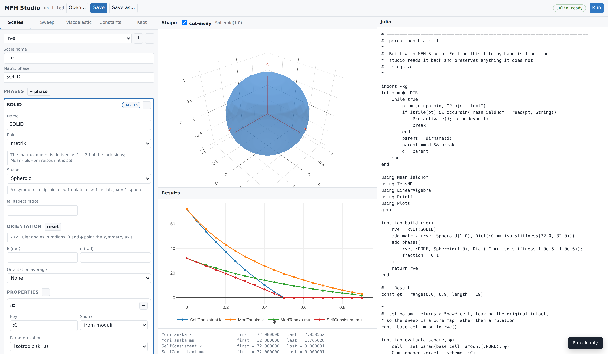
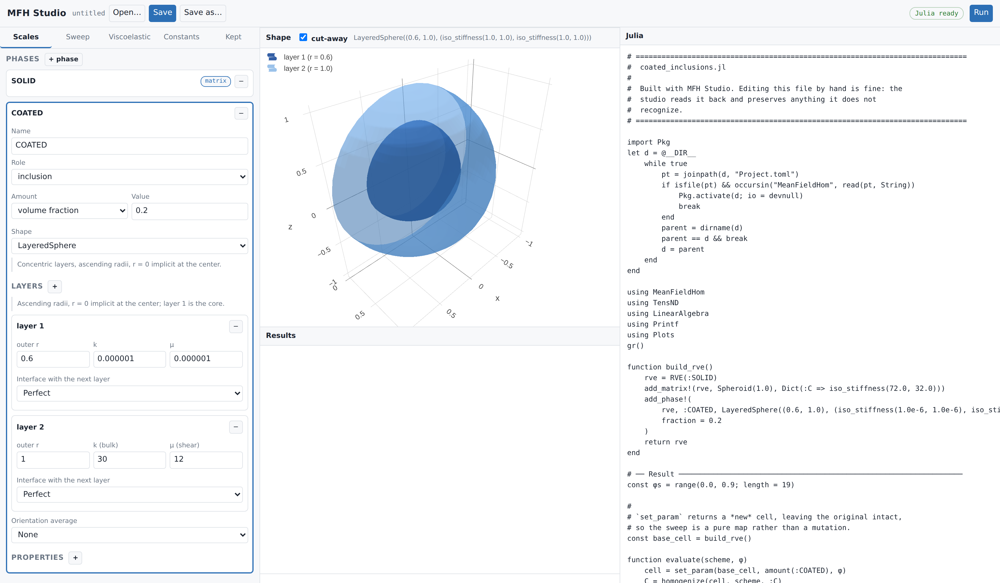
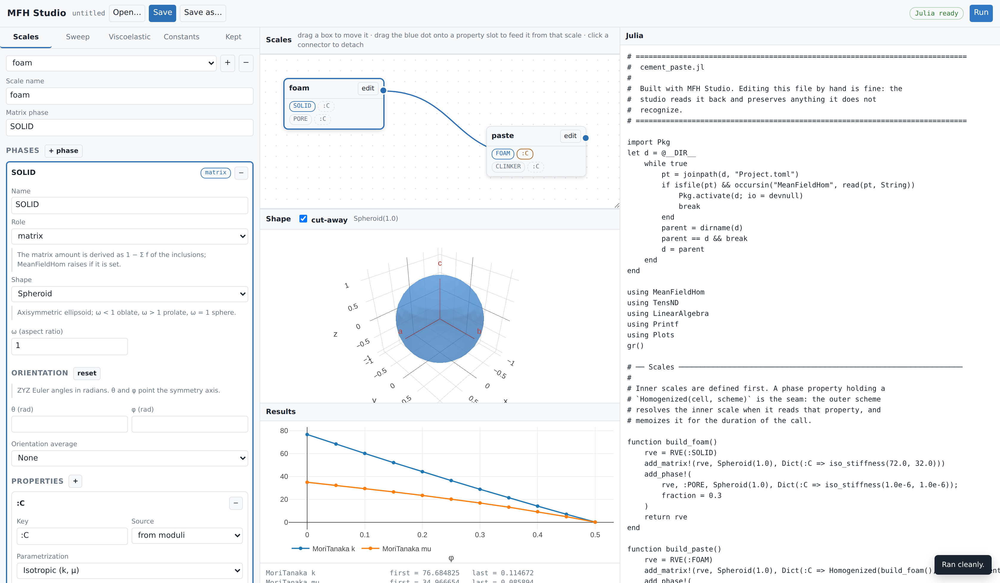
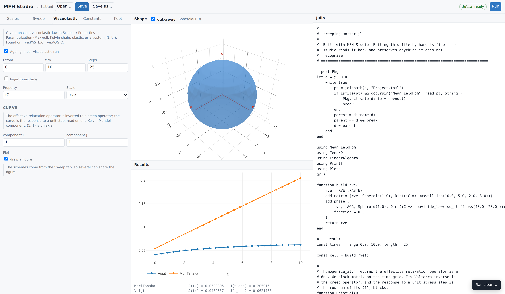

# [MFH Studio: building scripts graphically](@id tools-mfhstudio)

MFH Studio is a local web interface that builds MeanFieldHom scripts. It draws
the shape of the phase being edited, runs the model, and — the part that makes
it safe to use on existing work — **reads a script back** and preserves
everything it does not recognize.

The script stays the deliverable. The studio is a way of writing one, not a
format to be locked into.

## Starting the studio

From a Julia session with MeanFieldHom loaded — the studio ships with the
checkout you develop:

```julia
using MeanFieldHom
mfhstudio()                  # starts the server and opens a browser
mfhstudio(port = 9000)       # pick a different port
mfhstudio(no_browser = true) # stay in the terminal
mfhstudio(check = true)      # verify the Julia side and exit
```

`mfhstudio` blocks the REPL, like `Pluto.run()`, until the studio stops:
Ctrl-C in the REPL shuts the server and its Julia sidecar down cleanly. Pass
`wait = false` to keep working while the studio runs — it returns the process
handle, and `wait(p)` / `kill(p)` take it down again. `host`, `port`,
`project`, `julia` and `python` map onto the Python app's command-line options
below; `project = "@mfhstudio"` uses a shared environment, `julia = ...` /
`python = ...` point at a specific executable (or set the `MFHSTUDIO_PROJECT`
/ `MFHSTUDIO_PYTHON` environment variables).

The same tool starts from a shell — Python 3.10+ underneath, standard library
only:

```bash
cd tools/mfhstudio
python3 -m mfhstudio                # starts the server and opens a browser
python3 -m mfhstudio --port 9000    # pick the port
python3 -m mfhstudio --no-browser   # stay in the terminal
python3 -m mfhstudio --check        # verify the Julia side and exit
```

On Windows, `python -m mfhstudio`.

It needs Python 3.10+ (standard library only) and a `julia` on `PATH` able to
load MeanFieldHom. Loading the package takes about ten seconds, paid once when
the interface starts; the badge in the top-right turns green when it is ready.
On a fresh checkout the sidecar instantiates the package environment first,
which takes a few minutes once.

If Julia cannot start, the interface still comes up and says so in a banner:
building and saving a script works, while the 3-D view, reading a script back
and **Run** are off. `--check` diagnoses the Julia side without paying the load
time, and is the right first command on a new machine.

One failure is worth knowing about. A development machine's local
`Manifest.toml` — untracked, one per clone — may pin some dependencies to
sibling checkouts (`path = "../TensND.jl"`), which only resolve when those
siblings are there. If yours does and they are not, the studio does not need
the clone's environment at all: MeanFieldHom is registered in General, so a
shared environment resolves everything from the registry.

```julia
using Pkg
Pkg.activate("mfhstudio", shared = true)
Pkg.add("MeanFieldHom")
```

To run the studio against a clone you are editing rather than the released
version, develop it into that same environment instead:

```julia
Pkg.develop(path = raw"<path to MeanFieldHom.jl>")
```

Either way, start the studio against that shared environment —
`mfhstudio(project = "@mfhstudio")`, or `--project @mfhstudio` from the shell.
`--check` reads the manifest and names the missing checkouts itself.

## The layout



Three columns: the model on the left, the shape and the results in the middle,
the Julia on the right. The script is regenerated on every edit, so what is
displayed is exactly what **Save** writes.

The **Shape** panel draws the geometry of the phase currently selected — a
single inclusion, from its semi-axes and orientation. It is not a picture of the
microstructure:
mean-field homogenization never builds one, and nothing here places inclusions
in a volume or shows how they are distributed. What the panel is good for is
checking that the shape you described is the shape you meant.

The screenshot shows the porous benchmark after pressing **Run** — a solid
matrix ``(k, \mu) = (72, 32)`` with spherical pores swept over
``\varphi \in [0, 0.9]``. The numbers reproduce the reference values captured
from Echoes 1.0 (see [From Echoes to MeanFieldHom](@ref tools-from-echoes)).

Two conventions the interface removes rather than documents:

- The matrix phase has **no amount field**. MeanFieldHom derives it as
  ``1 - \sum f_{\text{inclusions}}`` and raises if it is set, so offering the
  field would only invite an error.
- Moduli are entered as physical ``(k, \mu)`` or ``(E, \nu)`` and emitted
  through [`iso_stiffness`](@ref). The raw `TensISO{3}` constructor, which
  takes ``(3k, 2\mu)``, never appears.

Shapes that have one carry an **Orientation** block: ZYZ Euler angles in
radians, as many as the shape admits — two for a spheroid or a penny crack,
which only need their axis pointed, three for an ellipsoid or an elliptic
crack. The field shows the degree equivalent beside the label, and the drawing
follows, so a mis-typed angle is visible rather than hidden until the numbers
come out wrong.

Solver options follow the scheme rather than `homogenize`, and the list offered
for each scheme is read from the scheme itself — `SelfConsistent` shows
`abstol`, `maxiters`, `damping`, `select_best`; `DifferentialScheme` shows
`nsteps` and `formulation`. The interface cannot fall behind MeanFieldHom
because it never hard-codes that list.

## Layered inclusions



Choosing `LayeredSphere` turns the phase editor into a table of layers — outer
radius, moduli, and the interface with the next layer (perfect, spring,
membrane, Kapitza, surface-conductive). The 3-D view cuts the shells open,
which is the only way a layered inclusion is readable at all: without the
cut-away only the outermost shell is visible.

Radii are ascending with ``r = 0`` implicit at the center, and layer 1 is the
core — the same convention as [`LayeredSphere`](@ref).

A [`LayeredSpheroid`](@ref) is described differently, because it must be
*confocal*: every layer shares one focal distance, and radii entered one by one
essentially never do. The form therefore asks for the outer aspect ratio, the
outer semi-axis and a **volume fraction** per layer, and
[`layered_spheroid_from_fractions`](@ref) solves for the confocal radii. It is
a conduction geometry, so its layers carry a conductivity rather than moduli.

## Multiscale



This is where the interface earns the most. MeanFieldHom chains scales
declaratively: a phase property may hold a `Homogenized(inner_cell, scheme)`
instead of a tensor, and the outer scheme resolves the inner scale when it
reads that key (see [Multiscale models](@ref man-multiscale)).

The **Scales** panel draws that graph. Each box is a scale; the blue dot on its
right is its effective property; the dashed slots are the property keys of its
phases. Dragging the dot onto a slot creates the seam — the connector appears
and the Julia updates immediately. Clicking a connector detaches it.

The screenshot reproduces the foam/paste model of the multiscale manual: a
foam homogenized self-consistently feeds the matrix of a paste containing
clinker inclusions. The generated script emits `build_foam()` **before**
`build_paste()`, because the graph is sorted topologically before writing.

A scale cannot feed itself: a connection that would close a cycle is refused
when it is made, not when the script runs.

The sweep can cross scales too. The `nested` lens reaches through a seam into
the inner cell, so sweeping the foam's porosity from the outer model is one
lens rather than a hand-written closure:

```julia
cell = set_param(base_cell, nested(:FOAM, :C, amount(:PORE)), φ)
```

!!! note "Not combinable with ageing viscoelasticity"
    An inner `Homogenized` cannot sit inside an ALV chain — the inner result
    would have to be re-expressible as a `ViscoLaw`. The interface refuses the
    combination instead of writing a script that fails at run time.

## Choosing what to compute

The **Sweep** tab decides the shape of the run.

*One point* homogenizes once with the amounts entered in Scales — the answer
when you simply want the number for the fractions you typed. *Sweep* varies one
lens over a range and draws the curve.

Either way the schemes are a **list**: adding a second one puts both on the
same figure, which is usually the reason to draw one. Each carries its own
solver options, and switching a scheme clears them, because they belong to the
scheme that reads them — `MoriTanaka(; verbose = false)` is a `MethodError`,
the singleton schemes taking no keywords at all.

The **outputs** are chosen too, and this matters more than it looks:

| Output | Defined for |
| :--- | :--- |
| `k`, `μ`, `E`, `ν` | an **isotropic** result only |
| Kelvin-Mandel component `KM[i,j]` | any symmetry |
| tensor component `C[i,j]` | 2nd-order properties (conduction) |
| `tr/3` | mean conductivity |

`k_mu` has a method for `TensISO` (a TensND type) and nothing else. An oriented
inclusion with no orientation average does not give an isotropic effective
tensor, so asking for `k` there fails deep inside the run with a `MethodError`.
The interface says so before you run: either pick a reporting projection, or
plot components, which are defined whatever the symmetry.

## Viscoelasticity

A phase becomes viscoelastic through its **property**, not through a separate
panel: in Scales → Properties → Parametrization, choose Maxwell, a Kelvin
chain, an elastic (Heaviside) phase, or a custom ``J(t, t')``. The generated
call uses MeanFieldHom's own signatures — `maxwell_iso(k, μ, η_k, η_μ)` takes
*two* relaxation times, `kelvin_iso` takes whole branch vectors.



The **Viscoelastic** tab then only decides the time grid and the curve. It
lists which phases carry a law, so a run with nothing to age says so rather
than failing later. `homogenize_alv` returns the effective relaxation operator
as a ``6n \times 6n`` block matrix; the curve is its Volterra inverse read on
one Kelvin-Mandel component — `(1, 1)` is the uniaxial creep response, the
extraction used in [`scripts/62_alv_schemes.jl`](../tutorials/generated/alv_schemes.md).

## Anisotropic properties

Conductivity comes in three forms: isotropic ``\kappa``, transversely
isotropic ``(\kappa_t, \kappa_a)``, and orthotropic ``(\kappa_1, \kappa_2,
\kappa_3)``. Stiffness offers isotropic ``(k, \mu)`` or ``(E, \nu)``,
transversely isotropic Hoenig parameters, and the nine orthotropic constants.
Anything else is typed as a Julia expression, which the generator passes
through untouched.

### The frame the constants are written in

An anisotropic tensor means nothing without its frame, so every anisotropic
form carries its own **Orientation** block of ZYZ Euler angles. It is *not*
the shape's orientation: a tilted fiber made of an untilted material and an
untilted fiber made of a tilted material are different materials, and the two
angle sets are stored and emitted separately.

What the angles produce depends on the symmetry class. A transversely
isotropic tensor carries an axis rather than a basis — ``\psi`` is irrelevant,
the transverse plane being isotropic — so the studio emits the third vector of
the frame:

```julia
hoenig_stiffness(30.0, 0.3, 0.2, 0.25, 0.5, vecbasis(RotatedBasis(π/4, 0.7, 0.0))[:, 3])
TensTI{2}(1.0, 5.0, vecbasis(RotatedBasis(π/4, 0.7, 0.0))[:, 3])
```

An orthotropic tensor needs all three directions, and takes the basis itself.
`Tens(A, basis)` stores `A` as the components **in that basis**, which is what
"diagonal in the material frame" means:

```julia
TensOrtho(120.0, 90.0, 70.0, 40.0, 35.0, 30.0, 25.0, 22.0, 20.0, RotatedBasis(0.3, π/3, 0.0))
Tens([1.0 0.0 0.0; 0.0 2.0 0.0; 0.0 0.0 5.0], RotatedBasis(0.3, π/3, 0.0))
```

Angles are radians, and the field accepts arithmetic: `π/4`, `2pi/3` and plain
decimals all work, an expression reaching the script as written rather than as
its seventeen-digit decimal. The degree equivalent is shown beside each field.

!!! note "The isotropic point of the Hoenig parametrization"
    ``h = 1`` together with ``\nu_1 = \nu_2`` and ``\gamma = 1`` is not a
    transversely isotropic material: it is the isotropic one, written in a
    transversely isotropic type. The axis then carries no information, and the
    schemes have a degenerate reference to work from. The defaults are away
    from that corner for this reason.

## Opening an Echoes script

**Open** accepts a `.py` as well as a `.jl`. Picking a Python file makes the
studio translate it with [`echoes2mfh`](@ref tools-echoes2mfh), ask where the
Julia should go, write it, and open the result — one action rather than a
separate convert button, because the extension already says which of the two is
happening.

The translator's findings come back with it. A script it could not translate
whole reports how many constructs it refused, and each one sits in the written
script as an `UNTRANSLATED` block that raises at run time, so a half-translated
model cannot quietly produce numbers.

## Reading an existing script

**Open…** browses the server's own filesystem — with shortcuts to `scripts/`,
the package root and your home directory — rather than using the browser's file
input. The browser never reveals a real path, and a path is exactly what saving
back to the same file needs; listing server-side also keeps the picker correct
when the studio runs on a remote machine. **Save** writes to the current file,
**Save as…** asks for a new one.

Reading a `.jl` file back, two things can happen.

A script the studio wrote carries its model in a trailing comment block and
reopens exactly. Any other script — a hand-written demo from `scripts/`, an
`echoes2mfh` translation — is parsed by the Julia side using `Meta.parse`, the
real parser, and matched against the vocabulary the generator emits.

**Everything else is kept verbatim.** It appears under the *Kept* tab, read
only, and is written back byte for byte. Editing the model never rewrites it.

The rule is stricter than "parse what you can": a construct is only claimed
when the studio can *prove* it reproduces it. Before accepting a builder, the
reader renders it exactly as it would be saved and compares with the source; if
the two differ, the original text is kept and the reason is shown. That is why
a demo like `scripts/28_porous_schemes.jl`, whose builder takes typed and
keyword arguments the model does not represent, opens without being damaged.

Constants behave the same way: one read from a file keeps its original text —
multi-line layout included — until you actually edit it.

Across the 57 demo scripts in `scripts/` and the translations produced by
`echoes2mfh`, opening and writing back leaves every line intact.

## What is not modeled yet

Sensitivities, laminates, and custom/FE/neural inclusions are outside the
current scope. A script using them opens and is preserved, but those parts are
not editable in the interface. Viscoelastic properties are entered as Julia
expressions (`maxwell_iso(10.0, 5.0, 1.0)`, `ViscoLaw((t, t′) -> …, :creep)`)
rather than through a dedicated form.

## See also

- [Multiscale models](@ref man-multiscale) — what the seam means and what it
  costs.
- [`echoes2mfh`](@ref tools-echoes2mfh) — the Echoes translator, which shares
  this tool's code generator.
